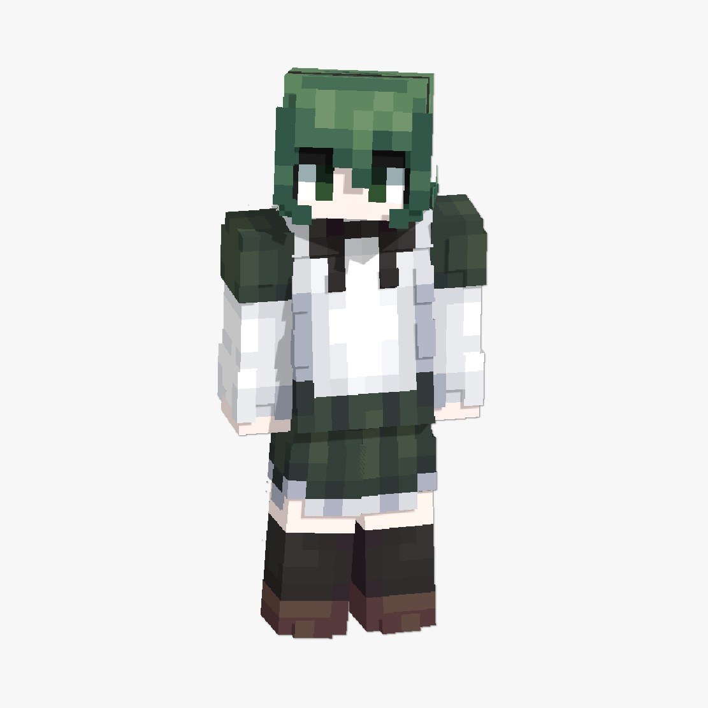

Prologue:
Player terbangun di suatu ruangan kosong hanya ada kaca transparan sebagai tumpuan sejauh mata memandang, hanya ada 1 npc dewi [Placeholder] (namanya masih bekum ditentuin)

Dewi: eh kamu disini? Kamu pasti kaget kenapa bisa ada disini kan?
Dewi: sebelumnya kenalin aku [nama] dewi pengatur alam setelah kematian, aku bertugas untuk memandu jalan bagi para jiwa tersesat
Dewi: alasan kamu disini pasti karena kematianmu tak wajar, iya kan?

Pilihan [Aku mati ditabrak tronton]

Dewi: oh ditabra- TRONTON?! 
Dewi: oke oke aku turut berduka atas kematianmu, jadi setidaknya aku akan berikan kamu sesuatu yang spesial sebelum pergi lebih jauh.
Dewi: jadi kamu mau apa?

Pilihan [Kekayaan] [Daya Tahan] [Kekuatan]

Kekayaan :set eco 25.000
Daya tahan: sk set defense 25
Kekuatan: sk set fighting 25

Dewi: oke sekarang selamat menikmati kehidupan barumu, aku harap kamu ga mati mengenaskan di kesempatan kali ini

Pilihan [ga akan lah, yakali]

Dewi: goodluck deh kalau gitu

[Teleport ke lobby utama]

Alice: , 
Sang penjaga perpustakaan mimpi dimana dia berada dibawah ajaran sang dewi harmoni di dunia natural smp
Sifatnya: cenderung kalem, dingin dan tidak terlalu pandai basa basi namun dia ornag yang baik
Role: sebagai perantara untuk membawa player ke tempat aveline

Aveline: , 
Sang dewi pelindung yang menjaga keharmonisan dunia natural.
Sifat: kesampingkan bahwa dia seorang dewi, dia bagaikan remaja yang baru puber dengan segala mood swing dan ego nya walaupun ia sudah hidup ratusan tahun, cenderung peduli namun enggan mengaku (tsundere)
Role: pemberi buff sementara secara gratis/harian 
[Kekuatan] [ketangguhan] [kegigihan]

Kekuatan: strength 2 (1 jam)
Ketangguhan: resistance 2 (1 jam)
Kegigihan: haste 2 (1 jam)